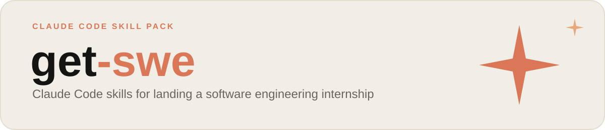

<p align="center">
  
</p>

<p align="center">
  
  
  
  
</p>

<p align="center">
  Everything a college student needs to land a software engineering
  internship, packaged as eight Claude Code skills: tailor your resume to a
  real posting, drill DSA and behavioral questions, run a full mock
  interview, find open postings, generate a portfolio project worth
  building, and get your GitHub audited like a recruiter would.
  <br><br>
  One install command. No setup. Just talk to it.
</p>

---

## Install

**Option A — via [skills.sh](https://skills.sh):**

```bash
npx skills add TheMuffinMan1320/get-swe
```

**Option B — one-line installer** (no dependency on the skills.sh CLI):

```bash
curl -fsSL https://raw.githubusercontent.com/TheMuffinMan1320/get-swe/main/install.sh | bash
```

Both install the 8 skills into `~/.claude/skills/`. Restart Claude Code (or
start a new session) afterward so it picks them up.

## How to use a skill

There are two ways to run any skill below:

1. **Just ask naturally.** Claude Code reads each skill's trigger phrases and
   invokes the right one automatically — e.g. typing "can you review my
   resume?" triggers `resume-review` on its own. No special syntax needed.
2. **Invoke it explicitly** by typing `/` followed by the skill name, e.g.
   `/resume-review`. Useful when you want a specific skill even if your
   phrasing is ambiguous, or when two skills could plausibly apply (e.g.
   `resume-review` vs. `resume-adapter`).

Most skills will ask you for whatever input they need (paste your resume, a
job posting, a GitHub username, etc.) if you don't provide it up front —
you don't need to prepare anything before starting.

## The 8 skills

| | Skill | What it does |
|---|---|---|
| 📄 | `resume-review` | General audit of a resume for internship applications — structure, ATS-compatibility, bullet quality — with rewrites. |
| 🎯 | `resume-adapter` | Tailors an existing resume to one specific job posting, reordered and reworded to match it, without fabricating experience. |
| 🔍 | `internship-posting-searcher` | Searches the web for currently open SWE internship postings matching your criteria. |
| 💡 | `project-idea-generator` | Generates resume-worthy project ideas scoped to a realistic timeframe, based on skills you want to showcase. |
| 🧠 | `leetcode-coach` | Socratic DSA practice partner — staged hints and pattern nudges instead of handing over solutions. |
| 🗣️ | `behavioral-interview-prep` | Coaches STAR-format answers and runs live mock behavioral Q&A. |
| 💻 | `mock-technical-interview` | Simulates a full live coding interview, playing interviewer, with a rubric-style debrief. |
| 🐙 | `github-portfolio-polish` | Audits your GitHub profile/repos for recruiter-readiness. |

Expand any skill below for exactly what it checks, how to run it, and what
you'll get back.

<details>
<summary><strong>📄 resume-review</strong> — general resume audit, no job posting needed</summary>

<br>

**What it does:** A general audit of your resume as-is for SWE internship
applications — no specific job posting needed. Checks section structure
(Education/Experience/Projects/Skills ordering), ATS-compatibility (flags
tables, columns, images, non-standard fonts that break automated parsers),
one-page length, and — bullet by bullet — whether each one has an action
verb, a specific technical contribution, and a quantified impact. Weak
bullets get rewritten, not just flagged.

**How to run it:**
```
/resume-review
```
or just say "review my resume" / "is my resume good enough for internships"
and paste or attach your resume when asked.

**What you'll get back:** A top-line verdict, issues grouped by category,
and concrete `Before → After` bullet rewrites.

</details>

<details>
<summary><strong>🎯 resume-adapter</strong> — tailor your resume to one specific job posting</summary>

<br>

**What it does:** Tailors an *existing* resume to a *specific* job posting.
Extracts the posting's required/preferred skills, scores your resume's
projects and experience against them, reorders content to lead with what's
most relevant, and rewrites bullets to mirror the posting's own language —
without inventing experience you don't have. Also honestly lists any
requirements your resume doesn't cover.

**How to run it:**
```
/resume-adapter
```
or say "tailor my resume to this job posting" / "does my resume match this
job description" — have both your resume and the full posting text ready to
paste in (a link alone isn't enough; paste the actual posting text).

**What you'll get back:** The extracted requirement list, a coverage map of
which resume entries match which requirements, the reworded/reordered
resume content, and a plain list of remaining gaps.

</details>

<details>
<summary><strong>🔍 internship-posting-searcher</strong> — find open SWE internship postings</summary>

<br>

**What it does:** Searches the web for internship postings that are
currently open, matching criteria you give it (target companies/industries,
location, class year, tech stack). It searches multiple angles — curated
GitHub internship-list repos, company career pages directly, and job boards
— and verifies postings look genuinely open rather than reporting stale
search snippets as fact. Requires web search tools to be available in your
Claude Code setup; if they're not, it'll say so rather than guess.

**How to run it:**
```
/internship-posting-searcher
```
or say "find SWE internships" / "who's hiring interns right now" — tell it
your target companies, location, class year, and tech stack (or say "open to
anything" if you don't have preferences yet).

**What you'll get back:** A table of Company | Role | Location |
Posted/Deadline | Link, plus a reminder to also check your school's
Handshake/career portal directly.

</details>

<details>
<summary><strong>💡 project-idea-generator</strong> — generate a portfolio project worth building</summary>

<br>

**What it does:** Generates a short, focused list of resume-worthy personal
project ideas based on specific skills or technologies you want to
showcase, scoped to how much time you actually have (a weekend vs. a few
weeks vs. a semester). Deliberately steers away from overdone portfolio
clichés (todo apps, weather-app API wrappers) in favor of ideas with a real
technical hook and a natural "impressive metric" for a future resume bullet.

**How to run it:**
```
/project-idea-generator
```
or say "give me project ideas" / "what should I build to show off React" —
tell it which skill(s) you want to demonstrate and how much time you have.

**What you'll get back:** 3-5 scoped ideas, each with what it is, why it
demonstrates the target skill, a realistic feature cut for your timeframe,
and what makes it non-generic. Pick one and it'll sketch a build-order plan.

</details>

<details>
<summary><strong>🧠 leetcode-coach</strong> — Socratic DSA practice partner</summary>

<br>

**What it does:** A Socratic data-structures-and-algorithms practice
partner — the opposite of an answer key. Makes you clarify the problem and
propose a first approach before giving any hints, then escalates through
hint levels (technique category → named pattern → walkthrough → full
solution) only as needed. Reviews time/space complexity and names the
underlying pattern at the end so you can find similar problems to drill.

**How to run it:**
```
/leetcode-coach
```
or say "help me practice LeetCode" / "quiz me on a DSA problem" — paste a
specific problem, or ask it to pick one for a pattern you want to drill.

**What you'll get back:** Staged hints (not spoilers), a correctness/edge-case
check on your solution, and a complexity + pattern debrief.

</details>

<details>
<summary><strong>🗣️ behavioral-interview-prep</strong> — STAR-method coaching and mock Q&A</summary>

<br>

**What it does:** Coaches STAR-format (Situation/Task/Action/Result) answers
for common internship behavioral questions, and can run a live multi-question
mock round with feedback after each answer. Catches the usual failure modes:
answers that are all "we" and no "I," vague results with no concrete
outcome, and answers that run too long.

**How to run it:**
```
/behavioral-interview-prep
```
or say "help me prep for behavioral interviews" / "practice STAR method" /
"run a mock behavioral interview" — give it a question you're working on, or
let it pick from its common-question list and run a full mock round.

**What you'll get back:** Either a polished STAR-structured version of your
answer, or live turn-by-turn mock Q&A with feedback, plus a pattern summary
of what to work on across your answers.

</details>

<details>
<summary><strong>💻 mock-technical-interview</strong> — full live coding interview simulation</summary>

<br>

**What it does:** Simulates a full live internship-level coding interview,
not just a single practice problem. Presents one appropriately-scoped
problem, plays interviewer for the whole round (answers clarifying questions
the way a real interviewer would, doesn't jump in with hints the moment you
pause, asks realistic follow-ups about complexity/edge cases/scaling), then
breaks character for a rubric-style debrief on communication, correctness,
complexity, and problem-solving process.

**How to run it:**
```
/mock-technical-interview
```
or say "run a mock technical interview" / "act as my interviewer" — tell it
your preferred language and any focus area, then treat it like a real
interview.

**What you'll get back:** A full simulated interview round, then a
structured debrief with 1-2 concrete things to work on next time.

</details>

<details>
<summary><strong>🐙 github-portfolio-polish</strong> — recruiter-readiness audit of your GitHub</summary>

<br>

**What it does:** Audits your GitHub profile for internship-application
readiness — the thing recruiters actually click through to after your
resume. Checks whether you have a profile README, whether you have pinned
repos (and whether the right ones are pinned), per-repo README quality
(setup instructions, demo/screenshot, stated tech stack), repo hygiene
(stale/empty repos cluttering your profile), and whether your pinned
projects actually align with the role you're targeting.

**How to run it:**
```
/github-portfolio-polish
```
or say "review my GitHub" / "is my GitHub good enough for internships" —
give it your GitHub username; if `gh` or web-fetch tools are available it'll
inspect the real profile instead of asking you to describe it.

**What you'll get back:** A top-line verdict, profile-level fixes, per-repo
fixes ordered by importance, and a flag if your pinned projects don't match
your target role (with a pointer to `project-idea-generator` to close that
gap).

</details>

## Contributing

PRs adding new internship-prep skills or improving existing ones are
welcome — keep each skill in its own top-level directory with a `SKILL.md`
following the existing format.

## License

MIT — see [LICENSE](./LICENSE).
